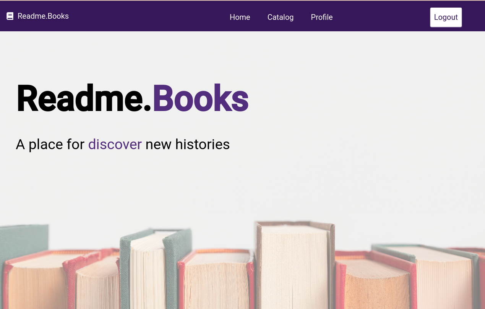

# Readme.Books

<h4 align="center"> 
	🚧  Readme.Books 🚀 Work in Progress...  🚧
</h4>

Welcome to Readme.Books, a React-based application designed for book enthusiasts. This platform allows users to rate and share their favorite books, providing an interactive space for book lovers. Users can log in, rate books they've read, and view others' ratings.

🚀 Created by Jessica Bandeira

<h1 align="center">
    <a href="https://readmebooks.vercel.app/">Live Preview</a>
</h1>

## Main Technologies Used
- React
- Tailwind CSS
- Node.js
- MongoDB

## Connect with Me 

  
  

